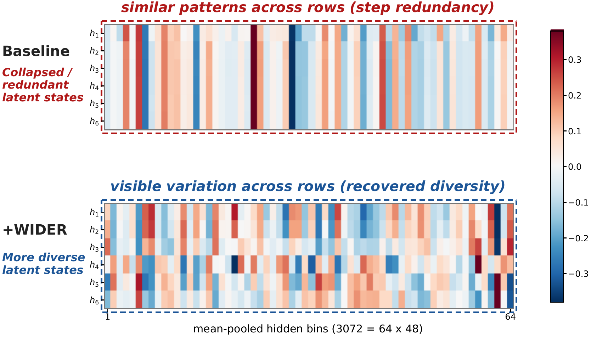

# Think Wider: Mitigating Latent Rank Collapse in Implicit Chain-of-Thought Reasoning

Official implementation of **WIDER** , a lightweight training objective for improving the geometry of implicit chain-of-thought reasoning. Accepted by EMNLP 2026🎉.

<div align="center">


</div>

Implicit chain-of-thought (CoT) reduces the need for lengthy rationale generation by carrying intermediate reasoning in continuous hidden states. Yet these trajectories can become repetitive, with successive states offering little variation beyond a common direction. **WIDER** tackles this **latent rank collapse** through a lightweight training penalty that discourages such concentration and helps the model make better use of its latent space. In our experiments, this improves the reasoning accuracy of existing implicit CoT frameworks. The regularizer is used only during training, so the original inference pipeline is retained with **no extra inference-time computation or latency**.

## Getting Started

### Installation

The commands below create a Python 3.12 environment from the committed lockfile.

```bash
git clone https://github.com/whitesweater/WIDER.git
cd WIDER
uv sync --locked --python 3.12
```

The training launchers activate the `.venv` environment automatically.

For gated Hugging Face models, obtain model access and authenticate before running the examples, or set `HF_TOKEN`. `MODEL_PATH` accepts a Hugging Face model identifier or a local model directory.

### Data preparation

```bash
uv run dataset/prepare_strategyqa.py
uv run dataset/prepare_commonsenseqa.py
uv run dataset/prepare_asdiv_aug.py
uv run dataset/prepare_aqua.py
```

Prepared data is written to `data/` by default. Set `WIDER_DATA_DIR` to use a different directory. Training launchers also prepare the selected dataset
when its required files are missing.

### Usage

Use the training launchers from the repository root. For
**LLaMA-3.2-3B-Instruct on ASDiv-Aug**:

```bash
export MODEL_PATH=meta-llama/Llama-3.2-3B-Instruct
export NPROC_PER_NODE=4

# CODI + WIDER
USE_DECODER=False EXPT_NAME=asdiv-codi-wider \
  bash scripts/train_llama3b_cuda_ddp.sh asdiv-aug wider

# SIM-CoT + WIDER
USE_DECODER=True EXPT_NAME=asdiv-simcot-wider \
  bash scripts/train_llama3b_cuda_ddp.sh asdiv-aug wider
```

Set `NPROC_PER_NODE` to the number of GPUs to use. Replace `wider` with `baseline` and choose a separate `EXPT_NAME` to train the corresponding
baseline. Supported datasets are `strategyqa`, `commonsense`, `asdiv-aug`, and `aqua`.

For **Qwen3-1.7B**, set `MODEL_PATH=Qwen/Qwen3-1.7B` and use [`scripts/train_qwen3_1_7b_cuda_ddp.sh`](scripts/train_qwen3_1_7b_cuda_ddp.sh).
The launchers provide the training defaults; see [`scripts/`](scripts/) for configuration and `uv run python test.py --help` for checkpoint evaluation.

## Repository Structure

```text
WIDER/
├── assets/figures/             # Original paper figures and README image exports
├── dataset/                   # Dataset preparation
├── scripts/                   # CUDA / distributed training launchers
├── src/
│   ├── model.py               # CODI / SIM-CoT models and loss integration
│   └── spectral_perspective_loss.py
├── train.py                   # Training entry point
├── test.py                    # Checkpoint evaluation
├── pyproject.toml             # Project and environment configuration
└── uv.lock                    # Locked Python dependencies
```

## Citation

If you use WIDER in your research, please cite:

```bibtex
@misc{hao2026thinkwider,
  title  = {Think Wider: Mitigating Latent Rank Collapse in Implicit Chain-of-Thought Reasoning},
  author = {Hao, Yuwen and Yang, Menglin},
  year   = {2026},
  url    = {https://github.com/whitesweater/WIDER}
}
```

## Acknowledgments

WIDER builds on [CODI](https://github.com/zhenyi4/codi) and [SIM-CoT](https://github.com/InternLM/SIM-CoT). We thank the authors of these methods and the maintainers of the backbone models and reasoning benchmarks
used in this work.

## License

This repository is released under the [Apache License 2.0](LICENSE).
